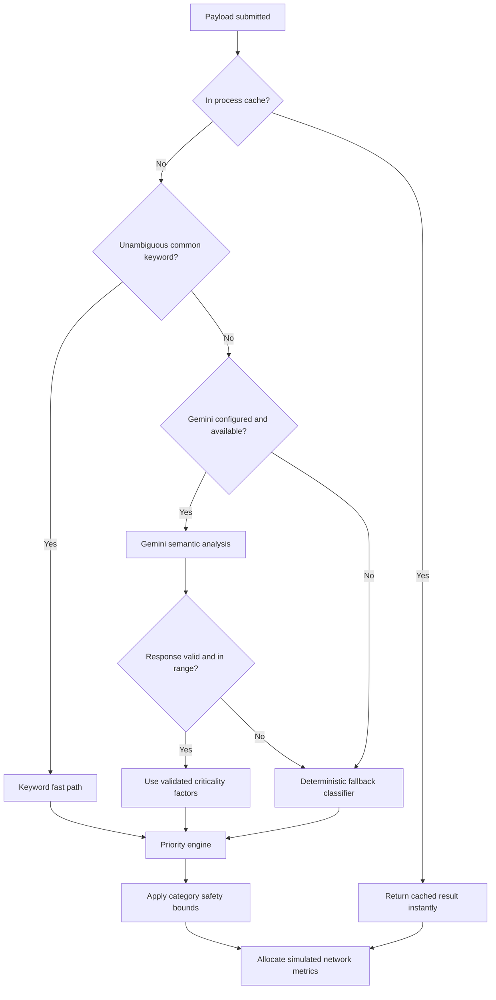

# NetSentient

NetSentient is a semantic network routing prototype that allocates simulated
bandwidth according to the priority of each task. Instead of treating every
network flow equally, it analyzes the meaning of a payload, assigns it a
priority tier, and protects high-value traffic when congestion is enabled.

The project includes a Flask/Python backend and a browser dashboard built with
HTML, vanilla JavaScript, Chart.js, and custom CSS. The dashboard can be served
directly by Flask at `http://localhost:5000` or opened from a separate static
frontend server while the API runs on port 5000.

## What It Does

- Classifies traffic into `emergency`, `critical_sensor`, `real_time`,
	`video`, `file`, and `background` tiers.
- Assigns a continuous priority score from 0 to 10.
- Allocates simulated delivery, latency, and packet-loss behavior according to
	priority when semantic routing is enabled.
- Shows active flows, network load, measured machine bandwidth, HTTP latency,
	per-flow delivery percentage, packet loss, simulated latency, allocation
	metrics, and priority history in the dashboard.
- Displays whether a new classification came from the keyword fast path,
	Gemini, or the deterministic fallback path; repeated inputs reuse the cache
	without repeating that work.
- Provides a visible explanation for the selected category, priority, and
	classification reason so the result is not just an unexplained number.
- Scans established local connections with `psutil` and adds their metadata to
	the dashboard. OS network connections do not contain enough semantic context
	to classify their payload meaning, so scanned flows are represented using
	metadata and default traffic information.
- Includes a routing lab that compares fair allocation with semantic routing
	during congestion.
- Uses responsive dashboard panels and Chart.js visualizations to present
	traffic distribution and priority history without requiring users to inspect
	raw API responses.

## Classification Pipeline

Every submitted payload follows a fault-tolerant pipeline. The goal is to keep
traffic moving even when an external AI service is unavailable.



### 1. Cache

Repeated payloads are normalized and looked up in an in-memory cache. A cache
hit avoids classification work and returns the previous result immediately.
This makes repeated priority allocation effectively instant and prevents
duplicate Gemini calls. Seeded common payloads are available immediately, and
newly classified payloads are memoized after their first lookup. The cache is
process-local and is cleared when the backend restarts or the classifier
configuration changes.

### 2. Keyword fast path

Short, unambiguous phrases such as `emergency alert`, `video call`, `file
transfer`, or `background sync` are handled by a curated keyword map. This path
is deterministic and avoids an unnecessary Gemini request. The classifier also
supports a broader rule-based keyword set for fallback classification, with
category-specific cues, phrase matching, confidence scoring, deterministic
tie-breaking, and a safe `background` result when no category matches. This
keeps simple requests available without network access or model latency.

### 3. Gemini semantic analysis

More descriptive or ambiguous payloads can be sent to Gemini when
`GEMINI_API_KEY` is configured. Gemini returns a category, confidence, and four
semantic factors:

- **Urgency:** how quickly the data must be delivered.
- **Consequence:** the impact of delay or loss.
- **Latency sensitivity:** how strongly the task depends on near-real-time
	delivery.
- **Reliability requirement:** how important successful delivery is.

The backend validates Gemini's response independently. Invalid categories,
missing fields, non-numeric values, and values outside the accepted 0-to-1
factor range are rejected rather than trusted. This protects the priority
engine from nonsensical or unsafe criticality scores returned by the model.

### 4. Deterministic fallback

If Gemini is unavailable because of a missing or invalid API key, network
failure, timeout, malformed output, or service quota/token exhaustion, the
payload is classified with the larger deterministic keyword/rule set. It still
receives a valid category and priority so the network operation can continue.
Fallback mode uses typical category factors instead of claiming to understand
the full context of the payload, and the API marks the result with
`source: "fallback"`.

### 5. Priority and guardrails

The priority engine combines the semantic factors with transparent weights:

```text
priority = 10 * (
		0.35 * urgency +
		0.30 * consequence +
		0.20 * latency_sensitivity +
		0.15 * reliability_requirement
)
```

The result is then clamped to a category-specific safety range. This prevents a
bad or exaggerated model response from assigning an implausible priority, such
as treating ordinary background work as emergency traffic. The category is
selected automatically by the classification pipeline, while the score remains
continuous within that category's allowed range.

## Observability and Allocation Metrics

The dashboard combines real measurements with clearly separated simulation
metrics:

- **Measured bandwidth:** a small cached download from the Flask host is used
	to estimate the machine's available throughput.
- **Measured HTTP latency:** the time to receive the first response byte is
	shown alongside the bandwidth estimate.
- **Network load:** the simulator reports the current load percentage and
	active connection count.
- **Flow allocation:** each simulated flow exposes delivery percentage,
	latency, packet loss, status, traffic tier, and priority. These values model
	how semantic routing would treat the flow under the current congestion mode;
	they are not a kernel-level bandwidth shaper.
- **Classification provenance:** analysis results identify the keyword,
	Gemini, or fallback path in the classifier panel and event stream. Cache hits
	reuse the original stored result without repeating classification or calling
	Gemini.

When semantic routing is switched off, the simulator uses its fair-allocation
behavior. Switching it on applies the priority-aware policy, allowing the
routing lab and charts to show the difference between the two modes.

## Dashboard Controls

- **Congestion:** simulates constrained network capacity.
- **Semantic routing:** toggles priority-aware allocation on or off.
- **Analyze and add flow:** classifies a payload and adds it to active traffic.
- **Scan local traffic:** reads established local connection metadata through
	`psutil`.
- **Load demo flows:** seeds a standard scenario for presentations.
- **Run demo:** resets the scenario, enables congestion, and compares routing
	behavior.
- **Reset:** clears the in-memory simulation state.

Charts make the changing data easier to compare by showing delivery percentage
over time and priority scores for recent flows.

## Project Structure

```text
NetSentient/
├── backend/
│   ├── app.py                         # Flask application and error handlers
│   ├── config.py                      # Priority policy and environment config
│   ├── models/schemas.py              # Request validation and API errors
│   ├── routes/                        # HTTP endpoints
│   ├── services/                      # Classification, routing, state, and metrics
│   ├── tests/                         # Backend test suite
│   ├── requirements.txt
│   └── README.md                      # Detailed API reference
└── frontend/
		├── index.html                     # Dashboard markup
		├── app.js                         # API integration and UI behavior
		└── styles.css                     # Dashboard styling and responsive layout
```

## Requirements

- Python 3.11 or newer
- A modern browser
- Optional: a Gemini API key for model-backed semantic analysis

The application works without a Gemini key. In that mode, it uses the keyword
and deterministic fallback paths.

## Installation

From the repository root on Windows PowerShell:

```powershell
Set-Location backend
python -m venv .venv
.\.venv\Scripts\Activate.ps1
python -m pip install -r requirements.txt
Copy-Item .env.example .env
```

On macOS or Linux:

```bash
cd backend
python3 -m venv .venv
source .venv/bin/activate
python -m pip install -r requirements.txt
cp .env.example .env
```

Edit `backend/.env` if Gemini analysis is desired:

```env
GEMINI_API_KEY=your-api-key
```

The default configuration is usable without changing this file.

## Run the Application

Start the backend from the `backend` directory:

```powershell
python app.py
```

Open the connected dashboard at:

```text
http://localhost:5000/
```

Flask serves the files in `frontend/` and exposes the API under `/api`. If the
frontend is served separately with a static server, it continues to use
`http://localhost:5000/api` for API requests.

## API Endpoints

All endpoints return JSON and are prefixed with `/api`.

| Method | Endpoint | Purpose |
|---|---|---|
| `GET` | `/api/health` | Check API availability |
| `GET` | `/api/network/status` | Read network and simulation metrics |
| `GET` / `POST` | `/api/traffic` | List or create traffic flows |
| `POST` | `/api/traffic/scan` | Scan local connection metadata |
| `POST` | `/api/classify` | Classify a payload and calculate priority |
| `POST` | `/api/simulation/congestion` | Enable or disable congestion |
| `POST` | `/api/simulation/semantic-routing` | Enable or disable semantic routing |
| `POST` | `/api/simulation/run` | Run a simulation step |
| `POST` | `/api/simulation/reset` | Reset in-memory state |
| `POST` | `/api/demo/reset` | Load the standard demo scenario |
| `POST` | `/api/demo/congest` | Run the congestion demo |
| `POST` | `/api/demo/compare` | Compare baseline and semantic routing |

Example classification request:

```powershell
Invoke-RestMethod `
	-Uri http://localhost:5000/api/classify `
	-Method Post `
	-ContentType 'application/json' `
	-Body '{"input":"ICU oxygen level has fallen to critical levels"}'
```

The response includes `category`, `confidence`, `priority`, semantic factors,
`source`, and a human-readable `reason`.

See [`backend/README.md`](backend/README.md) for the complete API contract,
request examples, environment variables, and backend architecture details.

## Testing

Run the backend tests from `backend/`:

```powershell
pytest -q
```

Tests cover health checks, request validation, classification, cache behavior,
Gemini integration boundaries, fallback behavior, simulation controls, demo
flows, and priority calculations.

## Design Limitations

- Simulation state is in memory and resets when Flask restarts.
- Bandwidth and delivery values represent a deterministic demonstration model,
	not a production traffic scheduler.
- OS traffic scanning provides connection metadata only; it cannot infer the
	semantic meaning of encrypted or otherwise unavailable payload contents.
- Gemini analysis requires network access and a valid API key. The fallback
	path is intentionally less context-sensitive but keeps the system available.
- CORS and the development Flask server are configured for local prototyping,
	not production deployment.